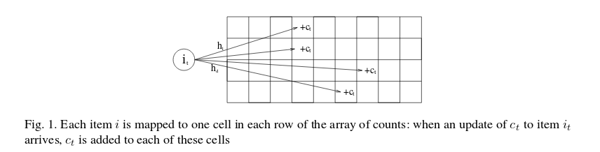

Title: Journal club: The khmer software package: enabling efficient nucleotide sequence analysis
Date: 2016-09-01
Slug: journal-club-khmer
Tags: de novo, bioinformatics, k-mers, Graphs, Python
Category: Journal Club
Author: Humberto Ortiz-Zuazaga

# Introduction

I will review the software tool article:

Crusoe MR, Alameldin HF, Awad S *et al.* The khmer software package:
enabling efficient nucleotide sequence analysis
[version 1; referees: 2 approved, 1 approved with reservations]. F1000Research
2015, 4:900
([doi: 10.12688/f1000research.6924.1](http://dx.doi.org/10.12688/f1000research.6924.1))

I love this paper for several interrelated reasons:

1. I am an author
1. The paper is controversial
1. Part of the controversy is whether or not I should be an author

Birney E. Referee Report For: The khmer software package: enabling
efficient nucleotide sequence analysis
[version 1; referees: 2 approved, 1 approved with reservations]. F1000Research
2015, 4:900
([doi: 10.5256/f1000research.7456.r10514](http://dx.doi.org/10.5256/f1000research.7456.r10514))

# Methods

The methods section of the paper describes how the software is
implemented and used.

The software has a core C++ library for k-mer counting and graph
traversal. The core is embeded into python with some custom C
code. Most of the user facing software is composed of python scripts
that call into the core libraries. khmer makes use of SeqAn's C++
parsers for sequence files.

Most of the algorithms used by khmer are described in other
papers. I'll show some methods below.

The use of khmer is described in detail online
<http://khmer.readthedocs.io/en/v2.0/>

# Use cases

## Digital Normalization

This was how I first learned about khmer. Titus has given several
workshops, including
[ours](http://2016-aug-nonmodel-rnaseq.readthedocs.io/en/latest/n-diginorm.html),
where he runs digital normalization on RNASeq data before assembly.

In fact, one of my contributions to khmer is a [one line patch](https://github.com/dib-lab/khmer/commit/a1b7334ffeeac99dac53677e0228cc2c617adade) to the digital normalization script.

<https://github.com/dib-lab/khmer/blob/v2.0/scripts/normalize-by-median.py#L162>

The method of digital normalization is described in this preprint:

Brown CT, Howe A, Zhang Q, et al.: A reference-free algorithm for computational normalization of shotgun sequencing data. arXiv preprint. 2012. Reference Source
<http://arxiv.org/pdf/1203.4802v2.pdf>

Which cites this paper for the underlying data structure:

Cormode G, Muthukrishnan S (2004) An improved data stream summary: the
count-min sketch, and its applications.  Journal of Algorithms
<http://dimacs.rutgers.edu/~graham/pubs/papers/cm-full.pdf>

Figure 1 from the above paper shows how count-min sketch works.

The Count Min sketch makes use of pairwise-independent families of
functions for hashing, which I had to google:

Broder, Andrei Z., et al. "Min-wise independent permutations." Proceedings of the thirtieth annual ACM symposium on Theory of computing. ACM, 1998.
<https://www.princeton.edu/~rblee/ELE572Papers/Fall04Readings/Misc/minwise.pdf>

## K-mer counting and read trimming

See:

Zhang Q, Pell J, Canino-Koning R, et al.: These are not the k-mers you
are looking for: Efficient online k-mer counting using a probabilistic
data structure. PLoS One. 2014; 9(7):
e101271. <http://dx.doi.org/10.1371/journal.pone.0101271>

## Graph partitioning

Howe AC, Jansson JK, Malfatti SA, et al.: Tackling soil diversity with
the assembly of large, complex metagenomes. Proc Natl Acad Sci U S
A. 2014; 111(13):
4904–9. <http://www.ncbi.nlm.nih.gov/pmc/articles/3977251>

# Discussion

The paper presents several practical applications of k-mer analysis of
next-generation sequencing data. These applications are implemented in
a mature software package, the khmer-tools. It serves as a good
**starting point** for learning about k-mers and de Brujin graphs.

As is typical of journal papers, to really understand it you need to
read many other papers, by digging through the references.

The khmer-tools development community is very open, and accepted my
contributions to the code quickly, even including me as an author on
this paper due to my small contribution to the code.
